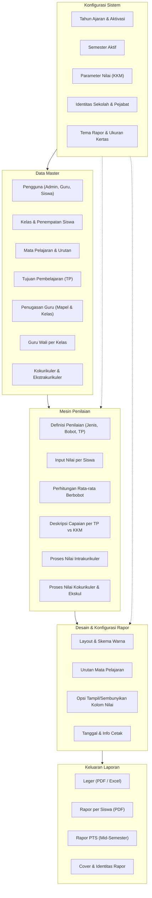

# Observasi Konseptual Sistem — Perspektif Analis Bisnis

**Peran:** Senior Business Analyst & System Architect  
**Sumber:** Logika bisnis dari dokumen *MODEL_SISTEM_PENILAIAN.md* dan fitur aplikasi (menu, alur, entitas).  
**Batasan:** Tidak mereferensikan teknologi atau tools tertentu; fokus pada **Entitas Bisnis**, **Modul Fungsional**, dan **Alur Kerja Pengguna**.

---

## 1. Conceptual ERD (Entity Relationship Diagram)

Diagram berikut memvisualisasikan struktur data dari sudut pandang **Data Master** dan **Pengaturan Sistem**: identitas sekolah, tahun ajaran, semester, orang (siswa & guru), akademik (kelas, mata pelajaran, tujuan pembelajaran), serta penilaian dan rapor.

```mermaid
erDiagram
    %% === School Identity & Configuration ===
    AcademicYear ||--o{ Class : "scopes"
    AcademicYear {
        string name "e.g. 2025/2026"
        string status "Active / Inactive"
    }

    SystemSettings {
        string setting_name "e.g. KKM, semester_aktif"
        string setting_value
    }

    SchoolProfile {
        string school_name
        string address
        string level "School level"
    }

    %% === People ===
    Teacher ||--o{ Class : "homeroom"
    Teacher ||--o{ TeachingAssignment : "teaches"
    Student ||--o{ Class : "belongs to"
    Student ||--o{ ReportCard : "receives"

    Teacher {
        string name
        string role
    }

    Student {
        string name
        string status "Active / etc"
    }

    %% === Academic ===
    Class ||--o{ Student : "contains"
    Class ||--o{ TeachingAssignment : "has"
    Subject ||--o{ LearningObjective : "has"
    Subject ||--o{ TeachingAssignment : "assigned"
    TeachingAssignment }o-- Class : "in"
    TeachingAssignment }o-- Subject : "for"
    TeachingAssignment }o-- Teacher : "by"

    Class {
        string class_name
        string academic_year_ref
    }

    Subject {
        string subject_name
        number display_order
    }

    LearningObjective {
        string description "TP - Tujuan Pembelajaran"
        string subject_ref
    }

    %% === Assessment ===
    Assessment ||--o{ Score : "produces"
    Assessment }o-- Class : "for"
    Assessment }o-- Subject : "for"
    Assessment }o-- Teacher : "created by"
    Assessment ||--o{ LearningObjective : "covers"
    Score }o-- Student : "belongs to"

    Assessment {
        string name
        string type "Formative / Summative"
        string sub_type "Summative TP / SAS / SAT"
        number weight
        number semester
    }

    Score {
        number value "0-100"
    }

    %% === Report Card ===
    ReportCard ||--o{ ReportAcademicDetail : "contains"
    ReportCard }o-- Student : "for"
    ReportCard }o-- Class : "for"
    ReportAcademicDetail }o-- Subject : "per subject"

    ReportCard {
        number semester
        string academic_year_ref
        number absences_sick
        number absences_excused
        string homeroom_notes
        string status "Draft / Final"
    }

    ReportAcademicDetail {
        number final_score
        string competency_description
    }
```

**Ringkasan relasi bisnis:**

| Relasi | Keterangan |
|--------|------------|
| Satu **Tahun Ajaran** menjangkau banyak **Kelas**. | Konfigurasi periode akademik. |
| Satu **Kelas** berisi banyak **Siswa**; satu **Guru** menjadi wali satu/beberapa kelas. | Orang dan kelas. |
| **Guru** diberi **Penugasan Mengajar** per **Mata Pelajaran** dan **Kelas**. | Siapa mengajar apa dan di kelas mana. |
| **Mata Pelajaran** punya banyak **Tujuan Pembelajaran (TP)**. | Kurikulum per mapel. |
| **Penilaian** terhubung ke Kelas, Mapel, Guru; punya banyak **Nilai** per siswa; bisa mengacu banyak **TP**. | Sumber nilai rapor. |
| **Rapor** per siswa berisi banyak **Detail Nilai Akademik** per mapel (nilai akhir + deskripsi). | Output nilai ke rapor. |

---

## 2. Functional System Architecture

Peta modul besar aplikasi berdasarkan menu dan fitur: konfigurasi, master data, mesin penilaian, desain/cetak rapor, dan keluaran laporan.



**Deskripsi modul (konseptual):**

- **Konfigurasi Sistem:** Menentukan tahun ajaran aktif, semester, KKM, identitas sekolah, dan pengaturan tampilan rapor (tema, ukuran kertas).
- **Data Master:** Mengelola pengguna, kelas, siswa, mata pelajaran, TP, penugasan guru, guru wali, serta kegiatan kokurikuler dan ekstrakurikuler.
- **Mesin Penilaian:** Mendefinisikan penilaian (formatif/sumatif, bobot, kaitan TP), input nilai, perhitungan nilai akhir (rata-rata berbobot), pembuatan deskripsi capaian, dan pemrosesan nilai kokurikuler/ekskul.
- **Desain & Konfigurasi Rapor:** Pengaturan layout, urutan mapel, kolom nilai, dan informasi yang tercetak di rapor.
- **Keluaran Laporan:** Hasil akhir berupa leger dan rapor (lengkap, PTS, cover, identitas) dalam bentuk PDF/Excel.

---

## 3. Business Process Flowchart (Siklus Tahun Ajaran — End-to-End)

Alur dari persiapan tahun ajaran sampai cetak rapor dan leger, tanpa menyebut teknologi.

```mermaid
flowchart TD
    Start([Mulai Siklus]) --> Prep

    subgraph Prep["Persiapan"]
        P1["Admin mengaktifkan Tahun Ajaran"]
        P2["Admin mengatur Semester Aktif"]
        P3["Admin mengatur Mata Pelajaran & Urutan"]
        P4["Admin / Guru menyusun Tujuan Pembelajaran per Mapel"]
        P5["Admin mengatur KKM & parameter lain"]
    end

    Prep --> Assign

    subgraph Assign["Penugasan"]
        A1["Siswa ditempatkan ke Kelas"]
        A2["Guru ditugaskan mengajar Mapel di Kelas"]
        A3["Guru Wali ditetapkan per Kelas"]
        A4["Pembina Ekskul & Tim Kokurikuler ditetapkan"]
    end

    Assign --> Assess

    subgraph Assess["Penilaian (Guru)"]
        AS1["Guru membuat Penilaian (Formatif / Sumatif)"]
        AS2["Untuk Sumatif: pilih subjenis & bobot, kaitkan TP"]
        AS3["Guru menginput Nilai per Siswa (skala 0–100)"]
        AS4["Sistem menghitung Nilai Akhir (rata-rata berbobot)"]
        AS5["Sistem membentuk Deskripsi Capaian dari TP vs KKM"]
        AS6["Input nilai Kokurikuler & Ekskul"]
    end

    Assess --> Wali

    subgraph Wali["Proses Wali Kelas"]
        W1["Wali menginput Data Rapor (absensi, catatan)"]
        W2["Wali menjalankan Proses Intrakurikuler (nilai akhir mapel)"]
        W3["Wali menjalankan Proses Kokurikuler (deskripsi projek)"]
        W4["Wali memastikan data rapor lengkap"]
    end

    Wali --> ReportDesign

    subgraph ReportDesign["Desain Rapor (Admin)"]
        RD1["Admin mengatur layout & skema warna rapor"]
        RD2["Admin mengatur urutan mapel & opsi tampilan"]
        RD3["Admin mengatur tanggal & info cetak"]
    end

    ReportDesign --> Finalize

    subgraph Finalize["Finalisasi & Cetak"]
        F1["Pilih siswa/kelas untuk cetak"]
        F2["Generate Leger (PDF / Excel)"]
        F3["Cetak Rapor per Siswa (PDF)"]
        F4["Opsi: Finalisasi status rapor"]
    end

    Finalize --> End([Akhir Siklus])
```



**Ringkasan tahap:**

| Tahap | Pemain | Kegiatan utama |
|-------|--------|-----------------|
| **Persiapan** | Admin | Tahun ajaran, semester, mapel, TP, KKM, pengaturan sistem. |
| **Penugasan** | Admin | Kelas–siswa, guru–mapel–kelas, wali kelas, pembina ekskul/kokurikuler. |
| **Penilaian** | Guru | Buat penilaian, input nilai; sistem hitung nilai akhir & deskripsi. |
| **Proses Wali** | Wali Kelas | Data rapor, proses intrakurikuler & kokurikuler. |
| **Desain Rapor** | Admin | Layout, urutan mapel, tema, tanggal cetak. |
| **Finalisasi** | Wali/Admin | Generate leger, cetak rapor, finalisasi status. |

---

## Catatan untuk Analis

- **Entitas** dalam ERD dinyatakan dalam istilah bisnis (Teacher, Student, Class, Subject, LearningObjective, Assessment, Score, ReportCard, SystemSettings, AcademicYear); pemetaan ke struktur data fisik sengaja tidak disebut.
- **Modul** dalam Functional Architecture dideduksi dari menu (Manajemen Master, Pengaturan, Bank Nilai, Proses Rapor, Cetak Rapor, Leger) dan dari dokumen *MODEL_SISTEM_PENILAIAN.md*.
- **Alur bisnis** menggambarkan siklus tahun ajaran yang khas: persiapan → penugasan → penilaian → proses wali → konfigurasi cetak → keluaran leger dan rapor.

Diagram dalam dokumen ini dapat dirender di viewer Markdown yang mendukung Mermaid (misalnya GitHub, GitLab, atau editor dengan preview Mermaid).
