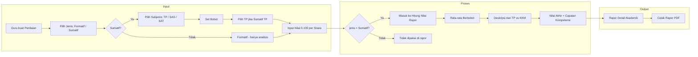
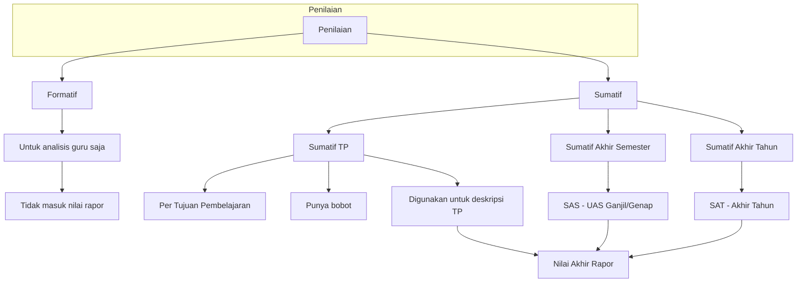
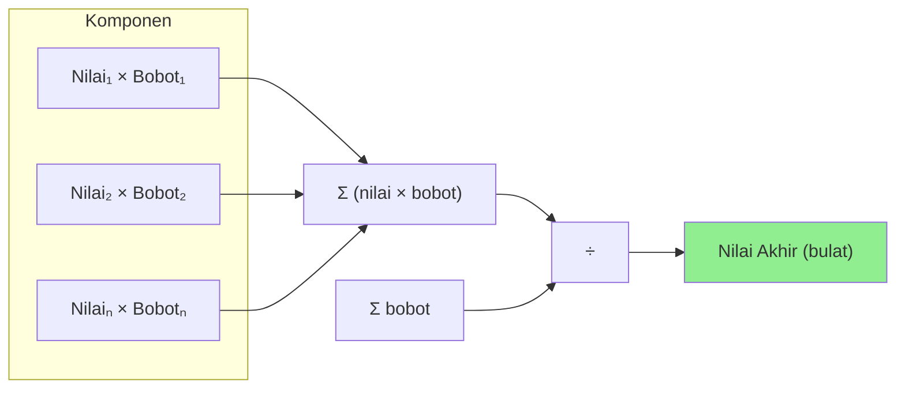
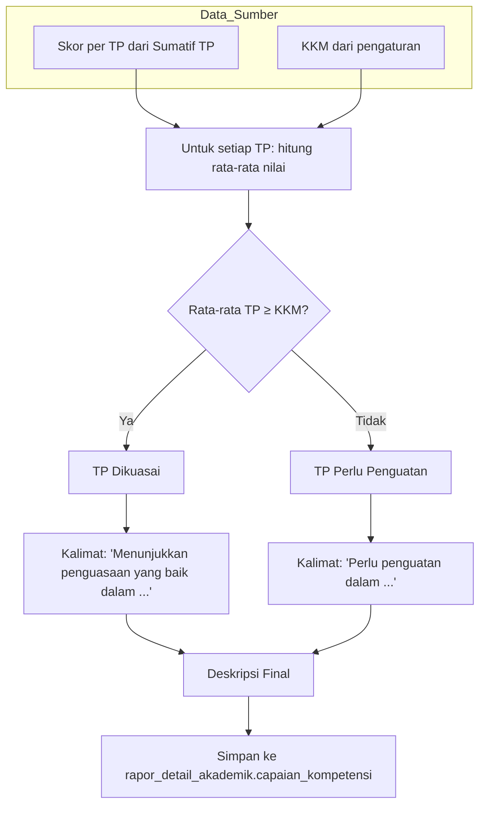
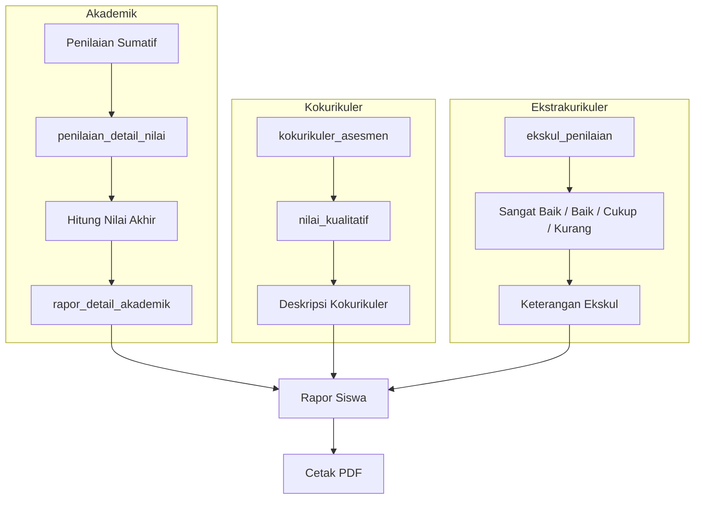

# Model Diagram Sistem Penilaian — Aplikasi Rapor

Dokumen ini memuat diagram model sistem penilaian dalam aplikasi rapor (format .md, diagram menggunakan Mermaid).

---

## 1. Diagram Entitas & Relasi (Data Penilaian Akademik)

```
┌─────────────────┐       ┌──────────────────────┐       ┌─────────────────┐
│     kelas       │       │     penilaian         │       │  mata_pelajaran │
├─────────────────┤       ├──────────────────────┤       ├─────────────────┤
│ id_kelas (PK)   │◄──────│ id_kelas (FK)        │       │ id_mapel (PK)   │
│ nama_kelas      │       │ id_mapel (FK)        │──────►│ nama_mapel      │
│ id_wali_kelas   │       │ id_guru (FK)         │       │ urutan          │
│ id_tahun_ajaran │       │ nama_penilaian       │       └─────────────────┘
└─────────────────┘       │ jenis_penilaian       │
                         │   [Formatif|Sumatif]  │       ┌─────────────────┐
                         │ subjenis_penilaian    │       │      guru        │
                         │   [Sumatif TP|        │       ├─────────────────┤
                         │    SAS|SAT]           │◄──────│ id_guru (PK)    │
                         │ bobot_penilaian       │       │ nama_guru       │
                         │ semester              │       └─────────────────┘
                         │ tanggal_penilaian     │
                         └──────────┬───────────┘
                                    │
                    ┌───────────────┼───────────────┐
                    │               │               │
                    ▼               ▼               ▼
         ┌──────────────────┐  ┌─────────────────────────────┐
         │  penilaian_tp     │  │  penilaian_detail_nilai      │
         ├──────────────────┤  ├─────────────────────────────┤
         │ id_penilaian (FK) │  │ id_penilaian (FK)             │
         │ id_tp (FK)        │  │ id_siswa (FK)                 │
         └────────┬─────────┘  │ nilai (0-100)                 │
                  │            └──────────────┬────────────────┘
                  ▼                           │
         ┌──────────────────┐                 │
         │ tujuan_          │                 │
         │ pembelajaran     │                 │
         ├──────────────────┤                 │
         │ id_tp (PK)        │                 │
         │ deskripsi_tp      │                 ▼
         │ id_mapel, ...     │         ┌─────────────────┐
         └──────────────────┘         │     siswa        │
                                      ├─────────────────┤
                                      │ id_siswa (PK)   │
                                      │ nama_lengkap    │
                                      │ id_kelas        │
                                      └─────────────────┘
```

---

## 2. Diagram Alur Penilaian (Flow)



---

## 3. Diagram Jenis & Subjenis Penilaian



---

## 4. Diagram Perhitungan Nilai Akhir (Rata-rata Berbobot)



**Rumus:**  
`Nilai Akhir = round( Σ(nilai × bobot) / Σ(bobot) )`

---

## 5. Diagram Pembuatan Deskripsi Capaian Kompetensi



---

## 6. Diagram Konteks Rapor (Rapor vs Penilaian vs Kokurikuler/Ekskul)



---

## 7. Tabel Ringkas Referensi

| Konsep | Keterangan |
|--------|------------|
| **Jenis penilaian** | Formatif (analisis) / Sumatif (nilai rapor) |
| **Subjenis Sumatif** | Sumatif TP, Sumatif Akhir Semester, Sumatif Akhir Tahun |
| **Bobot** | Integer ≥ 1, dipakai dalam rata-rata berbobot |
| **Nilai per siswa** | 0–100 (penilaian_detail_nilai.nilai) |
| **KKM** | Dari tabel `pengaturan` (nama_pengaturan = 'kkm'), default 75 |
| **Nilai akhir** | Rata-rata berbobot dari semua penilaian Sumatif mapel tersebut |
| **Deskripsi** | Dibuat dari ketercapaian TP (≥ KKM = dikuasai, &lt; KKM = perlu penguatan) |

---

*Dibuat dari analisis kode aplikasi rapor. Diagram Mermaid dapat dirender di GitHub, GitLab, atau viewer Markdown yang mendukung Mermaid.*
